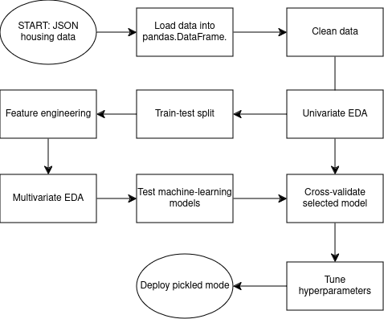
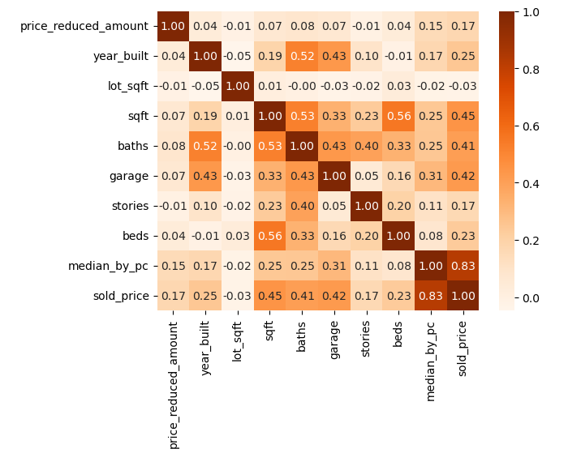
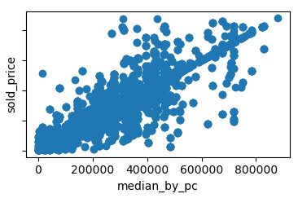
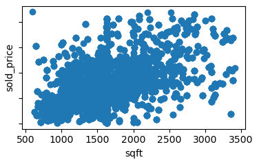

# Data Science Midterm Project: Predicting US House Prices

## Project/Goals

The goal of this project was to develop and deploy a machine-learning algorithm to predict home sales prices in the United States.

## Process

### Collect and Clean Data

The data was provided to us in the form of 250 JSON files, each containing information on a collection of home sales in some city in the United States. In general, each city of the dataset had several corresponding JSON files. We looped through all of the JSON files, collecting information on individual home sales including date, sale price, location, home description, and home tags and flags. We then converted the resulting dataset to a pandas DataFrame.

The DataFrame contained many nearly-empty, redundant, and/or irrelevant columns which were dropped. Also, the DataFrame contained some rows without a sales price. These rows were dropped as sales price was the intended target of the followup machine-learning analysis. Furthermore, the DataFrame contained many missing values which we imputed using either 0, False, a median, or a mode as appropriate.

We also engineered a handful of new features. Some features were engineered by combining several existing features together into a single new one. As an example, we merged the existing features 'community_outdoor_space', 'park', and 'trails' into a new feature, 'near_outdoors'. We also added a new feature, 'season', based on the time of year of the home sale. We note that a feature related to location really ought to be included in the analysis. We decided to use median sale price by postal code. However, to prevent data leakage, this feature must be added later on in the process, *after* the train-test split.

We one-hot encoded categorical features and converted Boolean features to integer features in preparation for a machine-learning analysis.

We plotted some univariate EDA visualizations, *i.e.,* box plots and histograms. From these, we noticed that our dataset contained many outliers. Rather than trim them all, we decided to trim those outliers stemming from features with at least a moderate correlation with home sales price (erring on the side of caution). Choosing those features was an iterative process based on correlation matrix elements and heat maps.

Next, we split our data into training and testing sets. In addition we engineered the median-sold-price-by-postal-code feature discussed earlier. Again, this feature had to be separately added to the training and testing datasets to avoid data leakage. Afterwards, the training and testing datasets were exported to CSVs.

Finally, we did some multivariate EDA in an affort to understand which features might be the most significant in predicting home sales prices. We produced a heat map of the features + target correlation matrix, and plotted several scatter plots as feature-selection aids.

### Model Selection

We investigated several classes of machine learning regression models and considered a number of scoring metrics.

#### Linear Regression (without and with Regularization)

Prior to fitting the linear regression models, we performed some preprocessing on the train-test dataset. In particular, we scaled all non-Boolean features using `MinMaxScaler()`. (We tried three different scalers actually: `MinMaxScaler()`, `RobustScaler()`, and `PowerTransformer()`. The results from `MinMaxScaler()`, and `RobustScaler()` were comparable while those of `PowerTransformer()` were slightly worse.) In addition, we used `SelectKBest()` to reduce the number of features under consideration from 50 to 8. (The value 8 was selected through trial-and-error.) Furthermore, we used `PolynomialFeatures()` to investigate the effects of higher-degree features on the regression analysis. The effects were insignificant. 

In the category of linear regression (perhaps with regularization), we considered ordinary least squares, Ridge, and Lasso. All performed similarly and yielded an adjusted least-squares training score of ~0.77 and an adjusted least-squares testing score of ~0.78. (For the particular train-test split that we used to develop our models, all linear regression models performed *slightly* better on the test data than they did on the train data.) For the Ridge and Lasso models, we probed a range of alpha hyperparameters which had little effect on model scores.

#### Support Vector Machine (SVM)

In the SVM category, we considered a linear kernel and an RBF kernel. The linear kernel yielded an adjusted least squares training score of ~0.74 and an adjusted least squares testing score of ~0.76, slightly worse performance than that obtained using linear regression. The KBF kernel, on the other hand, yielded better results than any of the linear regression models: in this case, we found an adjusted least-squares training score of ~0.83 and an adjusted least-squares testing score of ~0.82. To achieve these scores, we uses trial-and-error to select "optimum" values for the two hyperparameters C and gamma.

#### XGBoost
This model was trained after all the transformation of the dataset. It was trained using XGBRegressor and fitted to predict the scores. The scores predicted are Root Mean Square Error and R-square. On RMSE the scores are 17,777 and 28,168 on both train and test data set respectively. This means that the Media price by postcal code yields error of both 17,777 and 28,168 on training and test data respectively. This can be improveled but considering that we are talking about house prices, it can also be acceptable. 

Adding to above scores, r-square can give us further insights. this metric gives 99 percent and 97 percent on both training and test data respectively. This score suspicious (too good to be true) and one of the reasons can be possible overfitting. Since there are various models tried, this can also mean that other models are better on this dataset. 
#### Random Forest
For further analysis, this model scores two metrics: RMSE and R-square. On RMSE, the model scores 18,785 and 51,995 on both training and test respectively. On R-square, it scores 0.98 and 0.92 on both train and test data set respectively. RMSE metric still shows no improvement but using a different metric (R-quare) turns to be a better option. 

### Cross Validation and Parameter Hypertuning

Because it performed well, we chose the SVM model for fine tuning and deployment.

For cross validation, we were unable to use built-in Scikit-Learn modules as they would have led to leakage. The issue again comes back to the feature "median home price by postal code" which, of course, is an aggregation. Aggregating over the entire dataset would lead to leakage between training and validation data subsets. Instead, we partitioned the data into five training-validation folds, and, *within each training fold,* engineered the median-home-price in question.   

For hyperparameter tuning, we looped over a collection of hyperparameter settings and computed R-squared scores for each training-validation fold. Averaging over the five scores gave us an aggregate score for the hyperparameter collection in question. Finally, we chose the model with highest average R-squared and pickled it to file for the sake of posterity. 

## Results

Here, we show a heat map of the correlation matrix between home sales price and various numeric features included in our analysis.

This visualization suggested to us that the most important feature in determining the price of a home is neighbourhood (as captured by postal code). 

The second most important feature appeared to be square footage.

Other features that had noticeable correlations with home price were number of bathrooms and garage size as well as number of bedrooms and the year the house was built.

Our final pickled SVM model used the best eight features to predict home sales prices with an R-squared score of ~0.8. 

## Challenges 

Challenges we faced while working through this project included:
- Deciding on a suitable strategy for dealing with outliers. Using the IQR method for trimmin outliers 
- feature engineering

## Future Goals
(what would you do if you had more time?)
